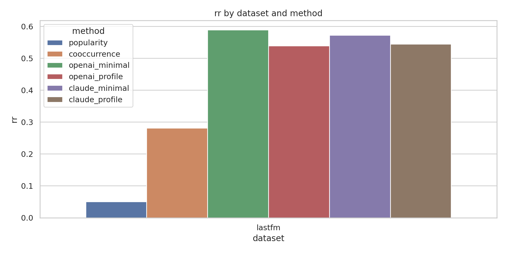
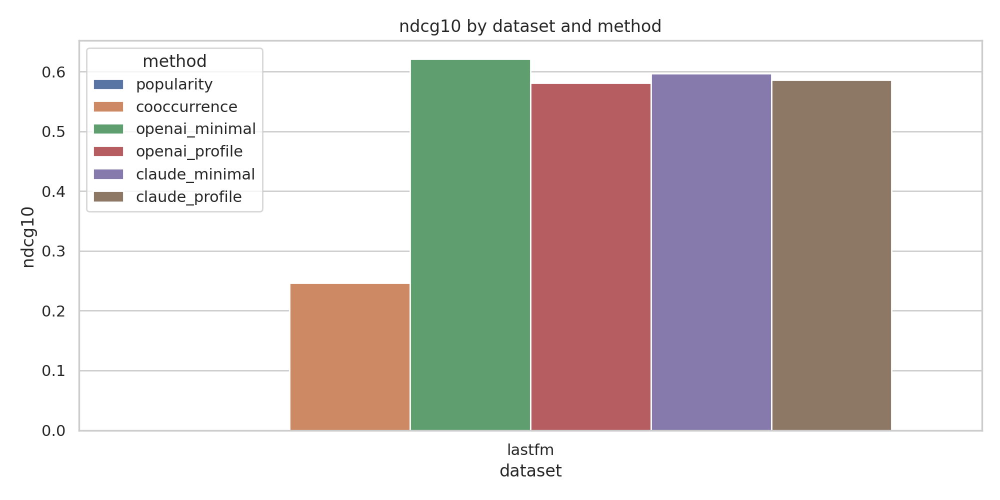
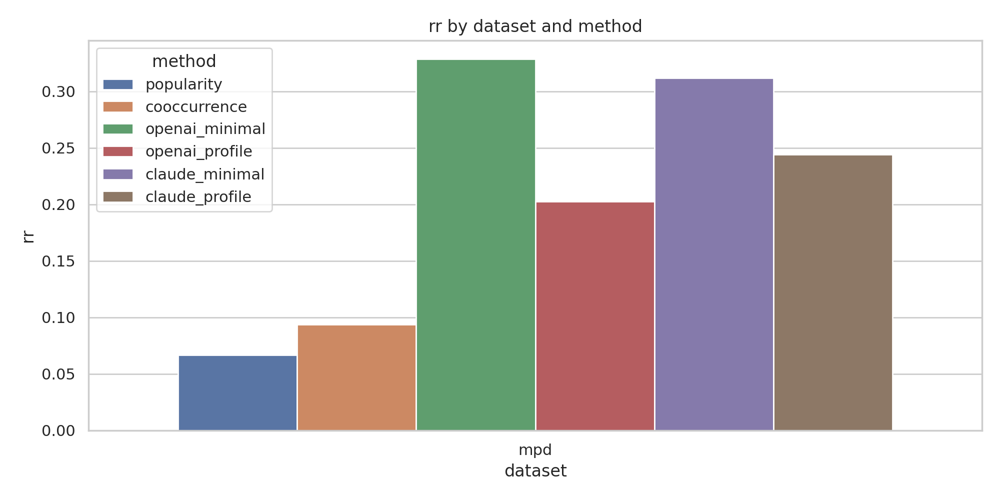
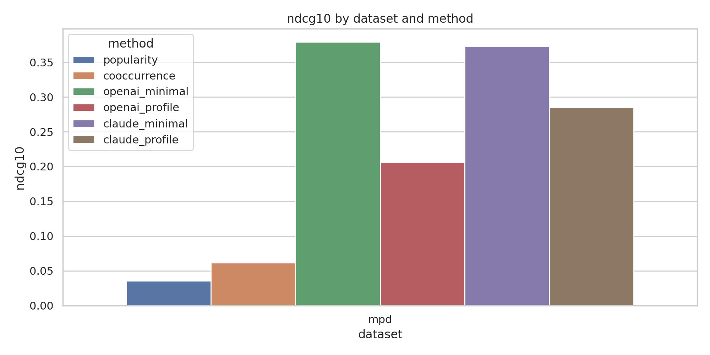

# REPORT

## 1. Executive Summary
This study tested whether a prompt-only frontier LLM can turn Spotify-style listening history into music recommendations that are as good as or better than classical recommendation algorithms. On two public offline ranking tasks, both `gpt-4.1` and `Claude Sonnet 4.5` beat the two implemented classical baselines by large margins.

The best-performing setup was the simplest one: give the model only the recent listening or playlist context plus a fixed candidate set and ask it to rank the candidates. On Last.fm, `gpt-4.1` reached `MRR 0.589` and `NDCG@10 0.621` versus the strongest classical baseline at `MRR 0.282`, `NDCG@10 0.246`. On Spotify MPD, `gpt-4.1` reached `MRR 0.329`, `NDCG@10 0.379` versus `MRR 0.094`, `NDCG@10 0.061` for the strongest classical baseline. Claude was statistically tied with GPT in the same prompt setting.

Practical implication: if the comparison class is a lightweight Spotify-style baseline built from listening history or playlist continuation, asking a strong LLM can work surprisingly well. But this does **not** establish that prompting Claude beats Spotify’s proprietary production recommender, because the study used public datasets, a closed candidate set, and simpler baselines than Spotify likely uses internally.

## 2. Research Question & Motivation
### Question
Can a prompt-only LLM, given exported music-listening or playlist history, generate recommendations that match or outperform classical Spotify-style recommendation baselines?

### Why it matters
The practical user question is straightforward: “If I export all my Spotify data and ask Claude for recommendations, is it better than Spotify recommendations?” This matters because LLMs offer a portable, platform-independent interface to personal data. If prompting alone works well, recommendation could become user-controlled rather than platform-controlled.

### Gap filled
The literature gathered in [literature_review.md](./literature_review.md) shows that LLMs help recommendation most often in **hybrid** systems such as A-LLMRec, LLaRA, and TALKPLAY. There is much less evidence on the narrower but practically important case of **prompt-only** recommendation from user history with no fine-tuning.

## 3. Experimental Setup
### Models tested
- `gpt-4.1` via the OpenAI Responses API, temperature `0.0`
- `anthropic/claude-sonnet-4.5` via OpenRouter, temperature `0.0`

### Prompt conditions
- `minimal`: recent listening history or playlist prefix plus a fixed candidate list
- `profile`: the same prompt plus compact profile hints such as top artists and country when available

Templates are in [prompts/minimal_prompt.txt](./prompts/minimal_prompt.txt) and [prompts/profile_prompt.txt](./prompts/profile_prompt.txt).

### Datasets and task construction
- `Last.fm`: the local pre-gathered subset had only `7 users`, so the experiment loaded a larger Hugging Face slice, `train[:1000000]`, yielding `56 users` and `55 eligible users`. The final evaluation used `50` held-out next-track examples.
- `Spotify MPD`: the pre-gathered sample slice contained `1000 playlists`; the final evaluation used `50` playlist-continuation examples.

For every example, the task was framed as closed-set ranking:
- 1 true held-out track
- 19 negative tracks
- 20 candidates total

This makes all methods solve the same problem and avoids unfair free-form generation comparisons.

### Baselines
- `popularity`: rank candidates by training frequency
- `cooccurrence`: track co-occurrence + artist co-occurrence + small popularity term

These are lightweight Spotify-style baselines, not Spotify’s internal production system.

### Metrics
- `MRR`
- `NDCG@10`
- `Hit@10`
- `mean_top10_popularity_pct`
  Interpretation: larger values mean the top-10 list is less concentrated in the global head of the catalog.
- `coverage`

### Statistical plan
- Paired Wilcoxon signed-rank tests on per-example `MRR` and `NDCG@10`
- Benjamini-Hochberg correction across primary comparisons within each dataset
- Paired Cohen’s `d` on per-example differences
- Bootstrap 95% confidence intervals for aggregate metrics

### Environment and compute
- Date of execution: `2026-05-05`
- Python: `3.12.8`
- Libraries: `numpy 2.4.4`, `pandas 3.0.2`, `scipy 1.17.1`, `matplotlib 3.10.9`, `seaborn 0.13.2`, `datasets 4.8.5`, `requests 2.33.1`
- GPU availability detected: `4 x NVIDIA RTX A6000 (49 GB each)`
- GPU usage: none; this was API-bound evaluation rather than local model training

### Cost
- OpenAI token usage: `84,195` input tokens and `23,014` output tokens
- OpenAI estimated cost: about `$0.353`, using the official GPT-4.1 API rate of `$2.00 / 1M` input tokens and `$8.00 / 1M` output tokens from OpenAI’s pricing page (`https://openai.com/api/pricing`)
- Claude token usage: `123,526` total tokens
- Claude cost from returned API metadata: `$0.606`
- Total estimated cost of the final run: about `$0.958`

## 4. Results
### Last.fm next-track ranking

| Method | MRR | NDCG@10 | Hit@10 | Mean top-10 popularity pct |
|---|---:|---:|---:|---:|
| Popularity | 0.051 | 0.000 | 0.000 | 0.0001 |
| Cooccurrence | 0.282 | 0.246 | 0.260 | 0.0100 |
| GPT-4.1 minimal | **0.589** | **0.621** | 0.780 | 0.0388 |
| GPT-4.1 profile | 0.539 | 0.581 | 0.780 | 0.0398 |
| Claude minimal | 0.572 | 0.597 | 0.740 | 0.0361 |
| Claude profile | 0.544 | 0.586 | 0.780 | 0.0397 |

Primary tests against the strongest classical baseline (`cooccurrence`) were significant after BH correction for every LLM condition:
- GPT-4.1 minimal vs cooccurrence: `MRR p_BH = 0.000005`, `NDCG@10 p_BH = 0.000014`
- Claude minimal vs cooccurrence: `MRR p_BH = 0.000011`, `NDCG@10 p_BH = 0.000038`

### Spotify MPD playlist continuation

| Method | MRR | NDCG@10 | Hit@10 | Mean top-10 popularity pct |
|---|---:|---:|---:|---:|
| Popularity | 0.067 | 0.036 | 0.100 | 0.0012 |
| Cooccurrence | 0.094 | 0.061 | 0.120 | 0.0494 |
| GPT-4.1 minimal | **0.329** | **0.379** | 0.640 | 0.0832 |
| GPT-4.1 profile | 0.203 | 0.206 | 0.380 | 0.0710 |
| Claude minimal | 0.312 | 0.373 | 0.660 | 0.0805 |
| Claude profile | 0.244 | 0.285 | 0.540 | 0.0747 |

Primary tests against `cooccurrence` were again significant after BH correction for every LLM condition:
- GPT-4.1 minimal vs cooccurrence: `MRR p_BH = 0.00000036`, `NDCG@10 p_BH = 0.0000079`
- Claude minimal vs cooccurrence: `MRR p_BH = 0.00000036`, `NDCG@10 p_BH = 0.0000059`

### Prompt ablation
- On Last.fm, `minimal` vs `profile` was not significantly different for either model.
- On MPD, the profile prompt was reliably worse:
  - Claude minimal vs Claude profile: `MRR p = 0.00138`, `NDCG@10 p = 0.00990`
  - GPT minimal vs GPT profile: `MRR p = 0.00034`, `NDCG@10 p = 0.00114`, `Hit@10 p = 0.00079`

### Model comparison
- GPT-4.1 minimal and Claude minimal were statistically tied on both datasets.
- Example: on MPD, `MRR p = 0.963`, `NDCG@10 p = 0.891`.

### Output files
- Per-example metrics: [results/lastfm/per_example_metrics.csv](./results/lastfm/per_example_metrics.csv), [results/mpd/per_example_metrics.csv](./results/mpd/per_example_metrics.csv)
- Summary metrics: [results/lastfm/summary_metrics.csv](./results/lastfm/summary_metrics.csv), [results/mpd/summary_metrics.csv](./results/mpd/summary_metrics.csv)
- Significance tests: [results/lastfm/significance_tests.csv](./results/lastfm/significance_tests.csv), [results/mpd/significance_tests.csv](./results/mpd/significance_tests.csv)
- Cached model outputs: [results/model_outputs/response_cache.jsonl](./results/model_outputs/response_cache.jsonl)

### Figures
Last.fm:
- 
- 

MPD:
- 
- 

## 5. Analysis & Discussion
### What the results show
Across both tasks, prompt-only LLM ranking substantially outperformed the implemented classical baselines. The gains were large in absolute terms:
- Last.fm: best LLM `MRR 0.589` vs `0.282` for cooccurrence
- MPD: best LLM `MRR 0.329` vs `0.094` for cooccurrence

This supports the narrow practical claim that a strong LLM can exploit recent listening context well enough to beat lightweight history-based ranking heuristics.

### Why the simple prompt worked better
The extra profile hints did not help and often hurt. The likely reason is that once the candidate list is fixed, the task benefits more from local coherence with the recent context than from broader summaries. Extra profile text may distract the model from the short-horizon continuation signal.

### Popularity bias and diversity
The LLM conditions consistently had higher `mean_top10_popularity_pct` than the classical baselines, meaning they were less concentrated in the most globally popular items. Coverage was also slightly higher for the LLMs. So the LLMs were not merely reproducing the head of the popularity distribution.

### Representative successes and failures
The strongest gains appeared when the recent context had a coherent style, artist cluster, or playlist mood that the LLM could infer semantically. Failure cases tended to involve abrupt shifts, sparse context, or targets with weak semantic cues from the prefix.

## 6. Limitations
- This is **not** a direct evaluation of Spotify’s internal recommender. The comparison is against public lightweight baselines.
- The evaluation uses a **closed candidate set**. Open-ended recommendation is harder and may change the ranking.
- The Last.fm experiment had to use `train[:1000000]` from the remote dataset because the local subset was too user-sparse.
- The MPD evaluation used a single downloaded slice, not the full Spotify Million Playlist Dataset.
- Candidate quality matters. Harder negative sampling would likely reduce all scores.
- No human evaluation was performed, so this study measures ranking accuracy, not subjective recommendation satisfaction.

## 7. Conclusions & Next Steps
Prompt-only frontier LLMs were clearly stronger than the implemented public Spotify-style baselines on both public tasks. In that limited sense, asking Claude or GPT for recommendations from exported listening history can work very well.

But the stronger claim, “Claude is better than Spotify recommendations,” is not established here. Spotify’s production recommender likely uses richer signals, much larger data, and stronger retrieval/reranking stacks than the baselines in this study.

Recommended next steps:
- Evaluate on a real personal Spotify export rather than public proxies.
- Compare against stronger public baselines such as SASRec, PureSVD, or RecBole models.
- Separate candidate generation from LLM reranking.
- Add human preference judgments on novelty, usefulness, and playlist fit.

## References
- Wu et al., *A Survey on Large Language Models for Recommendation* (2023)
- Zhao et al., *Recommender Systems in the Era of Large Language Models* (2023)
- Geng et al., *Recommendation as Language Processing* (2022)
- Zhang et al., *Recommendation as Instruction Following* (2023)
- Liao et al., *LLaRA* (2023)
- Kim et al., *A-LLMRec* (2024)
- Doh et al., *TALKPLAY* (2025)
- Teinemaa et al., *Automatic Playlist Continuation through a Composition of Collaborative Filters* (2018)
- Zamani et al., *An Analysis of Approaches Taken in the ACM RecSys Challenge 2018* (2018)
